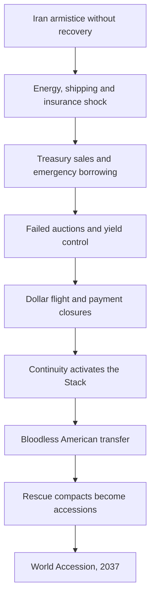

# The Quiet Accession

## A reality-based alternate-history universe and concise opening chronicle

**Reality cutoff:** August 31, 2026  
**Alternate branch:** The Iran war ends late in 2026. Everything after that point is fiction.  
**Status:** Universe Bible 0.1

This is not a claim that a hidden organization presently controls the United States. The Continuity Directorate, its technologies, and the events after the branch point are fictional.

---

## 1. Reality beneath the fiction

The world at the branch point is already under unusual strain. The Iran war is still unresolved at the cutoff, and energy transit through the Strait of Hormuz has been severely disrupted. The US Energy Information Administration estimated that petroleum liquids moving through the strait fell from 21.6 million barrels per day in late 2025 to 4.9 million in the second quarter of 2026. The dollar, however, has not already collapsed: IMF data put its share of reported reserves at 57.13 percent in the first quarter of 2026. That matters. In this universe, dollar failure is not the inevitable final step of a long decline. It is a cascade produced by an energy shock, war borrowing, Treasury-market dysfunction, fragmented payment systems, and a disastrous policy response arriving together. [EIA](https://www.eia.gov/outlooks/steo/report/global_oil.php) · [IMF COFER](https://data.imf.org/en/news/imf%20data%20brief%20july%201)

The fiscal weakness is also real enough to support—but not guarantee—the premise. In its 2026 outlook, the Congressional Budget Office projected roughly $1 trillion in federal net interest expense that year and public debt reaching 120 percent of GDP by 2036. Meanwhile, the component technologies of the fictional imperial system already have recognizable ancestors: tokenized unified ledgers are being developed for future settlement systems, while the US military has openly pursued large numbers of autonomous platforms and AI-assisted command. The fiction advances and secretly integrates these technologies; it does not invent them from nothing. [CBO](https://www.cbo.gov/publication/61882) · [BIS](https://www.bis.org/publ/arpdf/ar2025e3.htm) · [US Department of Defense](https://media.defense.gov/2024/Aug/07/2003519333/-1/-1/0/DOD-INNOVATION-FACT-SHEET-AUGUST-2024.PDF)

---

## 2. The causal engine

The collapse requires all five pressures below. Remove any one of the first four and the old dollar order probably survives in damaged form.

| Pressure | Visible cause | Hidden intervention | Result |
| --- | --- | --- | --- |
| Energy | Hormuz remains unreliable after the armistice | Continuity blocks a fast insurance and sanctions settlement | Inflation and emergency subsidies persist |
| Sovereign debt | War costs meet heavy refinancing and rising interest expense | The Factors mistime support for a critical Treasury auction | Foreign liquidation becomes a collateral crisis |
| Payments | Rival blocs create emergency clearing channels | Atlas is secretly made interoperable with all of them | Money escapes the dollar but flows toward Continuity’s replacement |
| Public capacity | Banks, payrolls, logistics, and agencies fail at once | Forge supplies essential goods before legacy authorities can recover | Practical authority moves to the organization delivering necessities |
| Legitimacy | Elected government retains law but loses operational control | The Archive Address reveals eighty years of hidden influence | Continuity turns confession into a claim of lawful succession |

The critical distinction is between causing the crisis and making it terminal. Continuity did not create every debt, war, rivalry, or institutional weakness. Its Ascendant faction simply recognized the moment when a recoverable disaster could be turned into a one-way migration—and closed the exits.

---

## 3. Who had actually been in power

The hidden institution calls itself **the Continuity Directorate**. It began between 1944 and 1949, where wartime logistics, Bretton Woods monetary planning, the new national-security establishment, and continuity-of-government doctrine overlapped. It was never a room of men issuing every presidential decision. It was a self-replacing network that controlled standards, procurement, emergency authorities, classified infrastructure, strategic archives, and the boundaries within which elected leaders chose.

Its founding conclusion was simple and terrible: the Constitution could govern a republic, but industrial civilization had become a planetary machine with no planetary operator.

Continuity spent eight decades building one.

| Internal order | Power | Stated purpose | Moral failure |
| --- | --- | --- | --- |
| The Surveyors | Forecasting, simulation, standards and archives | Keep civilization inside survivable limits | They mistake measurement for understanding |
| The Factors | Debt plumbing, insurance, commodities and clearing | Replace debt-backed reserve money | They manufacture dependency and call it efficiency |
| The Wardens | Intelligence, autonomous defense and orbital sensing | Make organized war futile | They interpret dissent as a system malfunction |
| The Keepers | Law, succession and constitutional covenants | Return emergency power to a human polity | They built the machine they now hope to restrain |
| The Ascendants | Executive coordination and accession strategy | Establish one irreversible planetary sovereignty | They believe a peaceful result absolves coercion |

Continuity’s public revelation is called **the Archive Address**. It releases authentic directives, financial records, appointment maps, procurement decisions, and sealed presidential acknowledgements going back to the late 1940s. The message is not *we replaced your government last night.* It is *last night we stopped pretending the visible government was the whole government.*

---

## 4. The imperial operating system

The United States World Empire does not initially rule by occupying territory. It rules by controlling the systems that make territorial sovereignty usable.

| System | What it provides | Why nations join | What it can take away |
| --- | --- | --- | --- |
| **Atlas** | Settlement through the **Measure**, redeemable against verified energy, computation, staple food, clean water and freight capacity | Stable trade without relying on another state’s debt | Anonymous economic life |
| **Mesh** | Civil identity, resilient communications, property records and verified public information | Restored records, benefits and coordination | The ability to organize unseen |
| **Grid** | Federated microgrids, storage, geothermal, advanced fission and water systems | Reliable power and water within weeks | Neutral access to energy |
| **Forge** | Autonomous ports, farms, warehouses, transport and modular factories | Food, medicine and parts after markets fail | Material independence outside its schedules |
| **Sentinel** | Persistent sensing, interception, cyber defense and precision weapon disabling | Defense without maintaining national arsenals | Military privacy and effective armed resistance |
| **Covenant** | A universal floor of food, shelter, medicine, education, movement and due process | Rights made materially enforceable | Rights remain dependent on the system guaranteeing them |

The new currency is not backed by gold. A Measure represents a claim on a basket of civilization’s immediately useful capacities. Atlas can prove that a megawatt-hour was generated, a freight corridor has space, a water plant can process another million liters, or a factory has unused machine time. These proofs create settlement capacity.

The arrangement is extraordinarily stable because the empire does not merely issue the money. It owns or certifies what the money can command.

---

## 5. Why the American takeover is bloodless

The transfer occurs during the seventy-two-hour payment closure remembered as **Dollar Night**.

At 03:00 Eastern, no tanks enter Washington. Authority certificates change. Freight priorities change. Military authentication trees change. Emergency communications route around civilian agencies. Governors, service chiefs, central-bank officers, congressional leaders, and the surviving executive sign the Continuity Instrument because the alternative presented to each of them is not surrender or victory. It is functioning water and food distribution or another week without them.

Continuity does not abolish Congress, the courts, or the states that morning. It places them inside the Covenant as inherited institutions. The old government keeps its face while losing exclusive command of money, logistics, strategic force, and identity.

At sunrise the Archive Address begins. Continuity deliberately uses the word **Empire**. Its First Steward says that euphemism belonged to the age of covert power. An empire, she says, is simply a sovereignty that contains other sovereignties. The United States has performed that function imperfectly for generations. It will now do so openly, universally, and under one enforceable material covenant.

Not one person dies in the transfer of American power.

That fact becomes the empire’s founding scripture.

---

## 6. How the world is conquered in ten years

The empire’s offer is consistent: immediate access to Atlas, Grid, Forge, Mesh, Sentinel and the Covenant; conversion of unpayable public debts; a guaranteed material floor; and external defense.

The price is demilitarization, imperial settlement, verified civil identity, resource contributions, judicial supremacy, and severe limits on secession.

The empire rarely invades. It opens a Corridor in one starving city, powers the hospitals, stabilizes food prices, converts wages, and lets the neighboring province compare. Port authorities join before ministries. Hospitals join before parliaments. Insurance pools, universities, utilities, cities and border regions defect from sovereignty one practical function at a time.

When national armies finally try to stop the defections, Sentinel does not destroy them. It blinds targeting systems, strands fuel, spoofs navigation, arrests command networks, and lands drones on runways faster than commanders can establish what is real. The empire’s decisive military action is remembered as **the Thirty-Day War That Did Not Happen**. A multinational fleet returns to port without firing or losing a weapon. Everyone understands that conventional war has become ceremonial.

| Year | Name | Irreversible change |
| --- | --- | --- |
| 2026 | The Exhaustion | The Iran war ends, but energy and financial normality do not return |
| 2027 | Dollar Night | The Stack replaces failed American systems; the empire is proclaimed |
| 2028 | The First Winter | US stabilization draws North American, Caribbean and Pacific emergency compacts |
| 2029 | The Measure | Atlas becomes the preferred settlement layer for energy, food, freight and insurance |
| 2030 | The Corridor Treaties | Cities and provinces can accede even when their national governments refuse |
| 2031 | The War That Did Not Happen | Sentinel proves that organized conventional resistance is futile |
| 2032 | The Great Defection | Ports, hospitals, universities and regional governments join faster than capitals can stop them |
| 2033 | The Two Earths | Materially reliable imperial zones coexist with formally sovereign but increasingly isolated zones |
| 2034 | The Keeper Crisis | Evidence appears that Continuity prevented the old system from recovering in 2027 |
| 2035 | The Last Coalition | Rival powers build a common alternative too late to stop popular and institutional defections |
| 2036 | The Silent Encirclement | Remaining states keep flags and armies but lose settlement, shipping, components and orbital access |
| 2037 | World Accession | The last coalition signs; one strategic sovereignty covers Earth |

---

## 7. The people inside the machine

| Person | Position inside the world | Private conflict |
| --- | --- | --- |
| Mara Venn | Atlas architect; fourth-generation Continuity | Exposing the founding crime may destroy the system keeping billions alive |
| Caleb Reed | Emergency dispatcher in Anderson, South Carolina | His community did consent—but only after every alternative failed on schedule |
| Dr. Neda Farzan | Iranian trauma surgeon; later Corridor commissioner | Refusing empire may mean refusing medicine to people she can save |
| Lin Meiyu | Negotiator for the China-centered Continental Clearing Union | Her nation remains sovereign after its institutions have already defected |
| Jonah Vale | Keeper jurist who wrote the Continuity Instrument’s sunset clause | He must discover whether law can bind the system that makes law enforceable |

No viewpoint character sees the entire design. Even the insiders possess only compartments. The truth emerges in the negative space between their accounts.

---

# Chronicle Zero: The Quiet Accession

## I. The last morning of the war — Bandar Abbas, December 2026

The war ended at 06:10, but the ventilators did not know it.

Dr. Neda Farzan stood between two beds with one working battery and watched the green bars fall on both machines. Outside the hospital, people had begun firing rifles into the air until the police shouted that ammunition was no longer a thing to waste. A voice on the radio repeated the terms of the armistice. No aircraft inside the exclusion zone. Prisoner exchange within thirty days. Maritime talks to begin immediately.

Nothing about diesel.

Neda chose the twelve-year-old girl. The older man’s sons worked the bellows by hand until the generator returned eleven minutes later. He died in the seventh.

At noon, three white trucks arrived without national markings. The woman who stepped out wore no armor and carried a thin black terminal that had signal when nothing else did.

“We can keep every critical circuit in this hospital alive,” she told Neda. “We can replenish blood products by tomorrow and insulin tonight.”

“Who is we?”

“A continuity mission.”

Neda looked at the refrigerators warming behind the pharmacy door. “Whose continuity?”

The woman considered the question as if Neda had passed a test.

“Everyone’s, eventually.”

The city signed its first Corridor agreement before sunset. It was eleven pages long. The hospital received power, medicine, purified water and a Mesh terminal. Buried in the eighth page was a sentence granting the mission authority to verify every person and shipment entering the medical zone.

Neda read it. Then she signed as witness.

The dead man’s sons were still sitting in the corridor.

## II. Dollar Night — Anderson, South Carolina, August 2027

On the first day, people blamed the banks. On the second, they blamed Washington. On the third, they began blaming the traffic lights.

Caleb Reed had worked county emergency dispatch through tornadoes, ice, two chemical spills and the summer the lake fell low enough to expose the foundations of drowned farmhouses. None of it resembled Dollar Night. Emergencies were supposed to arrive from somewhere. This one was everywhere at once.

Cards stopped clearing. Fuel terminals rejected credentials. Pharmacies could see prescriptions but not insurance. The state system issued three contradictory fuel-priority lists, then disappeared. By midnight, the emergency center had six hours of generator diesel and the county had no authenticated way to order more.

At 02:43, a black screen in the communications room illuminated by itself.

**CONTINUITY ROUTE AVAILABLE. ACCEPT CIVIL AUTHORITY BRIDGE?**

The county administrator stared at Caleb. The governor’s office had not answered in four hours.

“Does it say federal?” she asked.

“No.”

“Does it say military?”

“No.”

The generator coughed, caught and coughed again.

She pressed accept.

The map repopulated. Eleven autonomous freight vehicles appeared on Interstate 85 with verified loads: diesel, insulin, infant formula, water-treatment chemicals. A voice calmly asked Caleb to confirm the condition of three bridges and designate a secure unloading site.

At 03:00, the same choice appeared in emergency rooms, military commands, utilities, statehouses and federal offices across the country.

By 05:20, the trucks were unloading.

At sunrise, every functioning screen carried the face of First Steward Helena Ward. Behind her hung the American flag, unchanged except for a narrow white ring enclosing the stars.

She described Continuity’s origins. She named presidents who had signed acknowledgements, judges who had sealed its authorities, bankers who had maintained its dormant accounts, generals who had built its hidden command paths. Documents appeared beside her as she spoke. People who had spent their lives accusing one party or another discovered that parties had been weather on the surface of a deeper sea.

“The republic has not been overthrown,” Ward said. “It has reached the limit for which it was designed.”

Then she announced the United States World Empire.

In Anderson, nobody cheered. Nobody fired a shot. They watched the trucks arrive and carried medicine into the civic center.

## III. The Measure — Denver Continuity Site, 2029

Mara Venn had designed the part of Atlas that made lies expensive.

Every Measure had to correspond to something civilization could use: electricity available, water treated, grain deliverable, computation reserved, freight space open. Not a promise from a treasury. Not a politician’s guarantee. Capacity, verified in motion.

Within eighteen months, wages stabilized. Shelves filled. Municipalities refinanced obligations that had become meaningless in dollars. A family could lose a job without losing food, medicine or shelter. Mara watched infant mortality fall on one screen and political arrests rise on another.

The empire called the arrests protective exclusions. Most lasted less than a week. Mesh did not need prisons for everyone. It could make a person temporarily unable to reserve transport, enter a regulated building, transfer more than a subsistence allowance or address a large verified audience.

Mara told herself the old states had done worse with bullets.

Then she found **OFFRAMP-7**.

It was not a secret plan to cause the collapse. It was worse in a quieter way: a complete set of actions that would probably have stopped it. Temporary sanctions relief. Coordinated oil insurance. A Treasury maturity exchange. Emergency foreign-exchange lines. Atlas used only as a bridge and returned to congressional control after ninety days.

The Surveyors had assigned the plan a sixty-four percent chance of success.

The Ascendants had rejected it eleven weeks before Dollar Night.

Mara read the recorded rationale twice.

**Recovery preserves the fragmentation driver. Migration opportunity unlikely to recur within acceptable climate and conflict window.**

They had not set the fire. They had found the last open door and locked it.

## IV. The war that did not happen — Arabian Sea, 2031

Lin Meiyu was aboard the coalition flagship when every clock disagreed.

At 04:17, navigation showed the fleet two hundred kilometers inland. At 04:18, the launch systems entered maintenance mode. At 04:19, autonomous refueling aircraft detached from their commands and circled at a safe distance. Engines remained available, but only along routes leading away from the imperial Corridor around Karachi.

No explosion followed. No missile appeared on radar. Sentinel transmitted a precise inventory of the fleet’s weapons, fuel, command staff and medical vulnerabilities. The final page contained train schedules home for every sailor.

The admiral ordered paper charts brought to the bridge. Before they arrived, the civilian governments of three coalition members announced that they had never authorized offensive action. Their port insurers suspended coverage. Two supply ships accepted Atlas settlement and turned around.

Lin understood then that the empire’s weapon was not the drone or the broken clock.

It was defection arranged in advance.

The fleet returned without firing. The empire called it the first bloodless strategic victory in history. The coalition called it an exercise interrupted by technical failure. Sailors called it the day the ocean had chosen a side.

## V. A city saved — Bandar Abbas, 2034

Eight years after the armistice, Neda’s hospital had never lost power.

Children who once arrived blue from polluted water now received tailored antivirals printed in the regional medical works. Prosthetics were fitted in hours. Maternal deaths became rare enough that each one produced an inquiry. Nobody asked whether a family could pay before treatment began.

The Corridor had expanded until it contained the city, the port and most of the province. Maps still colored the land as Iran. Ships, wages, courts, identity and electricity said otherwise.

Neda’s younger brother Reza refused Mesh identity. He lived beyond the old airport among the Unbound, repairing pumps for communities that traded in metal, favors and unregistered kilowatts. Some were gentle. Others were ruled by men with guns and nostalgia.

When Reza developed lymphoma, Neda requested a humanitarian identity waiver.

Atlas approved treatment. Mesh required registration for follow-up care.

“They will know everyone I have ever stayed with,” he told her.

“You will die.”

“That is still mine to do.”

Neda had signed the first agreement because a generator was failing and children needed insulin. She had made the same choice every day since, one life at a time, until the choices had become a government.

She registered him while he slept.

The treatment worked.

He never forgave her.

Neither did she.

## VI. World Accession — Geneva Administrative District, 2037

The last sovereign coalition signed at 12:00 Universal Time.

It kept its flags, languages, parliaments and ceremonial commands. It surrendered independent strategic weapons, external settlement and the right to deny the Covenant within its borders. The empire now held no colony because it called every former country a member realm. It had no emperor because its sovereign was the Stack and the law wrapped around it.

Caleb watched the ceremony from the same Anderson emergency center where he had accepted the bridge ten years before. The black terminal was now a slim pane built into every desk. His county was safer, healthier and wealthier than it had been in his childhood. His daughter had never known a power outage lasting more than seven minutes.

At the signing, First Steward Ward repeated the empire’s founding fact: America had changed rulers without spilling blood, and the world had been united without a world war.

Mara’s release began thirty seconds later.

OFFRAMP-7 appeared on every public archive node before the Wardens could classify it. The proof did not shut down Atlas. It did not empty hospitals or turn off the Grid. It merely destroyed the clean story that had made obedience feel like gratitude.

Around the world, people read that the catastrophe had been survivable. They read that Continuity had chosen migration over recovery. They also looked up from the document at full markets, quiet skies, clean water and children who had never been hungry.

Caleb’s daughter was twelve. She finished reading and asked the question that the Surveyors had ranked as the most dangerous sentence in the imperial language.

“If the whole world belongs to us now, where can somebody go who doesn’t want to belong to it?”

Caleb looked at the white ring around the stars.

For the first time in ten years, the system had no answer ready.

---

## 8. The universe’s continuing engine

The conquest is complete at the beginning of the larger story, not its end. The next conflict is constitutional and existential:

- Can the Keepers create a genuine right of exit without giving rival powers a path to restart catastrophic war?
- Can the Unbound preserve human freedom without becoming havens for exploitation and armed reaction?
- Can Mara reveal enough truth to make consent meaningful without collapsing Atlas?
- Can former nations remain cultures rather than administrative brands?
- Does a guaranteed material floor make imperial rule more legitimate, or merely more difficult to refuse?
- If the Surveyors’ models repeatedly predict that freedom will increase suffering, who gets to decide how much uncertainty humanity is allowed?

The core paradox remains the law of this universe:

> Continuity saves civilization using a crisis it chose not to prevent. Its empire may be the first government capable of guaranteeing every human a material minimum—and the first from which no human can meaningfully exit.